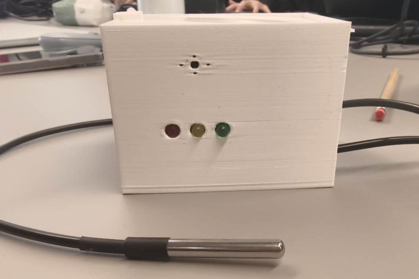

# Egg Cooking Status Indicator  
  
## Description  
This project is a simple Arduino-based system designed to monitor the water temperature while boiling eggs and provide clear visual and auditory feedback on the cooking process. Using a DS18B20 waterproof temperature sensor, the system lights up LEDs and activates a buzzer to indicate the cooking status.  

---

## Features  
1. **Real-Time Temperature Monitoring**: Continuously measures water temperature using the DS18B20 sensor.  
2. **LED Status Indicators**:  
   - **Red LED**: Lights up when the water temperature is below the target temperature.  
   - **Yellow LED**: Lights up when the target temperature is reached, and the countdown starts.  
   - **Green LED**: Lights up when the countdown finishes, signaling the cooking process is complete.  
3. **Buzzer Alert**: Sounds continuously when the egg is cooked, providing an auditory signal.  

---

## Components Used  
1. **Arduino Uno**: Microcontroller used to read temperature and control the LEDs and buzzer.  
2. **Waterproof DS18B20 Temperature Sensor**: Measures the water temperature accurately.  
3. **Red, Yellow, and Green LEDs**: Display cooking status.  
4. **Buzzer**: Sounds when cooking is complete.  
5. **4.7kΩ Resistor**: Required pull-up resistor for DS18B20's data line.
6. **Resistance (220Ω) x 3**: Limits the current of each LED to prevent overcurrent.

---

## Code Overview  

The Arduino sketch reads the water temperature, determines the cooking status, and activates LEDs and a buzzer accordingly. Here's a summary:  

- **Temperature Monitoring**:  
  Continuously measures water temperature using the DS18B20 sensor.  

- **LED Control Logic**:  
  - Red: Water not hot enough.  
  - Yellow: Target temperature reached; countdown in progress.  
  - Green: Cooking complete.  

- **Buzzer Activation**:  
  Sounds continuously after the countdown ends to indicate the eggs are ready.  

---

## How to Use  
1. Connect the components following the provided circuit diagram.  
2. Upload the Arduino sketch (`EggCookingMonitor.ino`) to the Arduino Uno.  
3. Place the DS18B20 sensor in the water and power the Arduino.  
4. Observe the LEDs and buzzer for real-time feedback on the cooking status.  

---

## Circuit Diagram  
 

1. Connect the DS18B20 data line to Arduino pin D2, with a 4.7kΩ pull-up resistor between the data line and VCC.  
2. Connect the LEDs to pins 8, 9, and 10 with appropriate resistors.  
3. Connect the buzzer to pin 11.  
4. Connect GND and VCC lines for all components.  

---

## Experimental demonstration

- Due to the size of the video, it cannot be viewed directly on the web page. But you can download it by clicking the link.

---

## Customization  
- Adjust the `targetTemp` (default: 90.0°C) for different cooking requirements.  
- Change `requiredTime` (default: 10 minutes) based on recipe needs.  

---

## License  
This project is released under an open-source license and is free to use for educational and personal purposes.  
